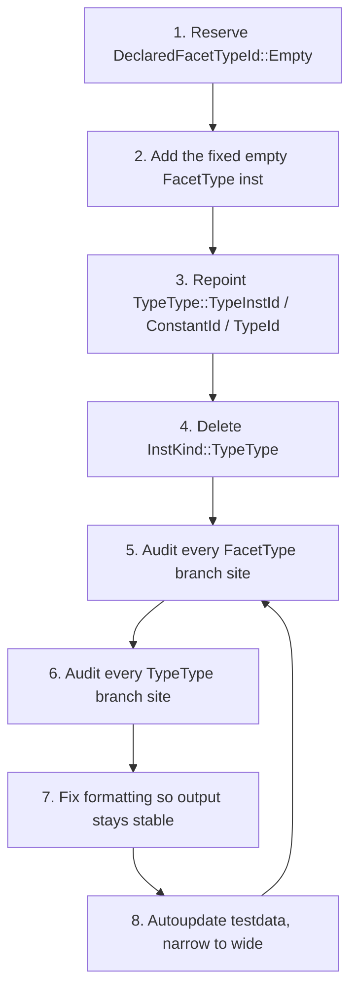

# Migrating `TypeType` to an empty `FacetType`

<!--
Part of the Carbon Language project, under the Apache License v2.0 with LLVM
Exceptions. See /LICENSE for license information.
SPDX-License-Identifier: Apache-2.0 WITH LLVM-exception
-->

## Goal

Today `SemIR::TypeType` is a payload-free singleton inst kind that represents
the type of a type value. A `FacetType` whose `DeclaredFacetType` has no
constraints means the same thing, but is a separate representation. This
migration unifies them: `TypeType` becomes an ordinary `FacetType` instruction
whose `DeclaredFacetTypeId` refers to a reserved, empty `DeclaredFacetType`.

The end state:

-   There is exactly one empty `FacetType` per `SemIR::File`, living at a fixed
    `InstId` so that it can be named at compile time. It is **not** a singleton:
    it has a fixed id, but `InstKind::FacetType` still has many insts.
-   `InstKind::TypeType` no longer exists.
-   `SemIR::TypeType` survives as a named scope holding `TypeInstId`,
    `ConstantId`, and `TypeId` static members, so the ~80 existing uses of
    `SemIR::TypeType::TypeId` keep compiling unchanged.
-   Toolchain behavior is unchanged, except for three intentional diagnostic
    changes listed under
    [Accepted behavior changes](#accepted-behavior-changes).

> [!IMPORTANT] This is one big change. The audit of `FacetType` branch sites
> cannot be meaningfully separated from the flip, because the flip is what makes
> those sites reachable for `type`.

## Locked design decisions

These were decided before the work started. Do not relitigate them; if you find
evidence that one is wrong, stop and report rather than improvising.

1.  **Reserved empty `DeclaredFacetTypeId`.** Index 0 of every file's
    `DeclaredFacetTypeStore` is reserved for the empty `DeclaredFacetType`. Add
    a `DeclaredFacetTypeId::Empty` constant, mirroring the existing
    `StructTypeFieldsId::Empty` precedent in
    [ids.h](../../../toolchain/sem_ir/ids.h) and the reserved-id constructor
    arguments in [file.cpp](../../../toolchain/sem_ir/file.cpp). Note that
    `declared_facet_types_` is a _tagged_ `CanonicalValueStore`, so the reserved
    id must be created by passing a reserved count to the constructor,
    `declared_facet_types_(check_ir_id, 1)`, which leaves index 0 untagged.
2.  **`TypeType` is no longer an inst kind.** It loses its `Kind` member and its
    fields, and stops deriving from `SingletonTypeInst`. It becomes a named
    scope holding `TypeInstId`, `ConstantId`, and `TypeId`, so the ~80 existing
    uses of `SemIR::TypeType::TypeId` keep compiling unchanged. Remove
    `CARBON_SEM_IR_INST_KIND(TypeType)` from
    [inst_kind.def](../../../toolchain/sem_ir/inst_kind.def).
3.  **The empty facet type is _not_ a singleton.** Singleton means "one inst per
    inst kind", and `FacetType` has many insts. Give it a reserved fixed
    `InstId` outside `SingletonInstKinds` instead, and create it with the same
    `ConstantStore::GetOrAdd` call any other facet type would use. No new `Inst`
    factory and no new constant-store entry point are needed. This is the
    decision most likely to be got wrong; see
    [Hazard 2](#hazard-2-do-not-make-facettype-a-singleton-kind).
4.  **The empty facet value _is_ the type value.** A `FacetValue` whose
    `type_id` is `TypeType::TypeId` evaluates to the `type_inst_id` inside it.
    This preserves the invariant that "constant whose type is
    `TypeType::TypeId`" means "type value", so
    [`CheckTypeOfConstantIsTypeType`](../../../toolchain/sem_ir/type.cpp) and
    its callers keep working. See
    [Hazard 1](#hazard-1-keeping-the-is-a-type-value-invariant-true).
5.  **It prints as `type`.** `inst_namer` special-cases it so testdata churn
    stays mechanical. See [Formatting](#formatting).

## Order of work



Steps 1-4 are plumbing and will not compile cleanly until much of step 5 is
done. Expect to iterate between 5, 7, and 8 repeatedly; that loop is the bulk of
the work.

> [!CAUTION] Autoupdating is destructive to your evidence. Once you have run the
> autoupdater, the previous expectations are gone from the working copy, and a
> behavioral regression looks identical to an accepted change. Read the STDERR
> diff after _every_ autoupdate, and if a diagnostic changed for a reason you
> cannot name, fix the code before autoupdating again.

## Core plumbing

### Reserve the empty declared facet type

-   Add `DeclaredFacetTypeId::Empty` and make the `File` constructor seed the
    store so that index 0 is the canonical empty `DeclaredFacetType`. The store
    is a `CanonicalValueStore`, so seeding it makes every later `Add` of an
    empty value return the reserved id automatically.

### Add the fixed empty facet type inst

`type` needs a compile-time-known `InstId`, but it must not be a singleton; see
[Hazard 2](#hazard-2-do-not-make-facettype-a-singleton-kind). Generalize
`singleton_insts.h` from "singletons occupy the first `InstId`s" to "a fixed
block of `InstId`s, only some of which are singletons":

```cpp
constexpr auto NumInstsBeforeSingletons = 1;  // TypeType::TypeInstId
constexpr auto NumInstsAfterSingletons = 1;   // Namespace::PackageInstId
constexpr auto NumFixedInsts = NumInstsBeforeSingletons +
                               SingletonInstKinds.size() +
                               NumInstsAfterSingletons;
```

-   Remove `InstKind::TypeType` from `SingletonInstKinds` without replacing it,
    and give `TypeType` index 0, ahead of the singletons, so that the singletons
    can name it as their type. `Namespace::PackageInstId` was already a fixed
    inst after the singletons; it is the precedent to follow, and the two are
    worth naming consistently (`MakeFixedTypeTypeInstId`,
    `MakeFixedNamespacePackageInstId`). Note that a namespace is not a type, so
    the latter returns `InstId`, not `TypeInstId`.
-   Everything that maps between singleton indices and `InstId`s has to account
    for the offset: `Internal::GetSingletonInstIndex` returns
    `i + NumInstsBeforeSingletons`, and `IsSingletonInstId` subtracts it before
    the range test. Getting this wrong is quiet: ids still look plausible, but
    `IsSingletonInstId(TypeType::TypeInstId)` answers the wrong question.
-   `File`'s member init uses `insts_(this, NumFixedInsts)` for the untagged
    count. Because `TypeType` gives up a singleton slot and takes a fixed one,
    the total is unchanged and raw inst ids do not shift.
-   Give it a self-referential `TypeId`, and `SetComplete` it in the `File`
    constructor exactly as `TypeType::TypeId` is completed today.

Construct it in the `File` constructor **before** the singleton loop, through
the constant store, so that it is the canonical constant for its value:

```cpp
auto type_type_const_id = constants_.GetOrAdd(
    FacetType{.type_id = TypeType::TypeId,
              .declared_facet_type_id = DeclaredFacetTypeId::Empty},
    ConstantDependence::None);
CARBON_CHECK(type_type_const_id == TypeType::ConstantId);
CARBON_CHECK(constant_values_.GetInstId(type_type_const_id) ==
             TypeType::TypeInstId);
```

The two `CHECK`s are what tie the hardcoded index to reality; keep them.

### Deduplication requirements

Two properties must hold after the change:

-   **Within a file**: every empty facet type constructed by any path
    (`MakeFacetTypeResult`, `where` handling, `&` combination that cancels out)
    evaluates to the canonical inst.
-   **Across files**: importing an empty facet type from another file must
    resolve to the _local_ canonical inst, not a fresh one.

Both fall out of `ConstantStore::GetOrAdd` keying on the `Inst` value, provided
the inst was created through it. Resist adding an `InsertSingleton`-style back
door to the constant store: needing one is a sign the inst is being created the
wrong way.

## The audit

**The definition of "a type" does not change.** A type is any value whose type
is `TypeType`, and the type of `TypeType` is still recursively `TypeType`. Only
the C++ representation of `TypeType` changes. Keep this straight, because it
determines which sites are mechanical and which are not.

Equality against the `SemIR::TypeType` static members keeps working verbatim,
because the empty facet type is canonical: there is exactly one per file. Four
distinct idioms use it:

-   For an inst `i`, `i.type_id() == SemIR::TypeType::TypeId` means "`i` is a
    type value". This meaning is **unchanged** by the migration.
-   For a value already known to be a `TypeId`,
    `type_id == SemIR::TypeType::TypeId` asks _which_ type it is: namely, is it
    the type `type`. Conversely, in a branch that already knows it has a facet
    type, `type_id != SemIR::TypeType::TypeId` means exactly "this is a
    constrained facet type".
-   Given an `InstId` or `TypeInstId`, compare directly against
    `SemIR::TypeType::TypeInstId` to ask whether that inst is `TypeType`. There
    is no need to convert the inst id to a `TypeId` first. This works for the
    same reason the others do: there is exactly one such inst per file.
-   `SemIR::TypeType::ConstantId` is the same thing as a constant id. Add it as
    a static member alongside `TypeInstId` and `TypeId`, mirroring
    `SemIR::ErrorInst`, and derive `TypeId` from it. It removes the
    `TypeType::TypeId.AsConstantId()` spelling and is what the `File`
    constructor `CHECK`s against.

> [!TIP] Prefer these equality tests over introducing new
> `IsEmptyFacetType`-style predicates, and prefer whichever of `TypeId` or
> `TypeInstId` the surrounding code already has in hand. They keep the code
> recognizably the same as before the migration.

`types().Is<FacetType>(type_id)` is the test that changes meaning. It used to
imply "constrained facet type", and is now also true for `type`. Where the old
code used `types().Is<FacetType>(i.type_id())` as shorthand for "`i` is a facet
value rather than a type value", the expression no longer says that. Every one
of these is suspect.

> [!IMPORTANT] There is no safe default rewrite for the `Is<FacetType>` sites.
> Do not mechanically insert `HasNoConstraints()` early-outs to preserve the old
> shape, and do not mechanically let everything flow through the facet path.
> Reason about each site individually.

For each site, classify it:

-   **Collapses.** The site already handled both `TypeType` and `FacetType`
    separately. Merge the two branches. These are the wins the migration exists
    to produce; `IsFacetType` in [type.h](../../../toolchain/sem_ir/type.h),
    `GetPeriodSelfType` in
    [handle_where.cpp](../../../toolchain/check/handle_where.cpp), the
    `TypeType`/`FacetType` cases in
    [type_iterator.cpp](../../../toolchain/sem_ir/type_iterator.cpp),
    [custom_witness.cpp](../../../toolchain/check/custom_witness.cpp), and
    [lower/type.cpp](../../../toolchain/lower/type.cpp) are all of this shape.
-   **Genuinely unaffected.** The facet path already does the right thing for an
    empty facet (loops over zero constraints, identification yields zero
    required impls). Delete any now-redundant `TypeType` early-out.
-   **Needs a guard.** The site means "constrained facet type" specifically, and
    must now say so. Spell that with the `TypeStore::IsConstrainedFacetType`
    helper described below, rather than open-coding
    `Is<FacetType>(type_id) && type_id != TypeType::TypeId` at each site.
-   **Means something else entirely.** The site used
    `types().Is<FacetType>(type_of_x)` as shorthand for "x is a facet value, not
    a type value". After the merge that is no longer what the expression tests.
    These are the dangerous ones, and `!= SemIR::TypeType::TypeId` is usually
    the **wrong** repair for them; see
    [Hazard 6](#hazard-6-facet-values-versus-concrete-type-values).
-   **Becomes a no-op.** The site converts a type value into a facet value.
    Delete it; a type value already is a facet value. See
    [Type-to-facet conversions become no-ops](#type-to-facet-conversions-become-no-ops).

`TypeStore::IsFacetType` was `type_id == TypeType::TypeId || Is<FacetType>`,
which collapses to plain `Is<FacetType>`. Delete it and convert its callers,
rather than leaving a wrapper whose name no longer describes anything
distinctive. In its place add the inverse helper, which the audit shows is what
callers actually want:

```cpp
// Returns whether the type is a facet type with constraints, which is to say
// any facet type other than `type` itself.
auto IsConstrainedFacetType(TypeId type_id) const -> bool {
  return type_id != TypeType::TypeId && Is<FacetType>(type_id);
}
```

`IsFacetTypeOrError` stays, since the `ErrorInst` disjunct still earns it.

When merging an if/else that covered the empty and non-empty cases separately,
prefer a single combined branch over keeping both with a redundant condition.
That simplification is a goal of the migration, not incidental cleanup.

> [!TIP] After merging branches, re-read the _enclosing_ block. Because these
> tests nest, collapsing an outer branch frequently makes an inner
> `Is<FacetType>` or `!= TypeType::TypeId` redundant. Three such nested guards
> turned up in [convert.cpp](../../../toolchain/check/convert.cpp) and
> [type_completion.cpp](../../../toolchain/check/type_completion.cpp), each
> already implied by its parent. Check every site, but do not assume: most
> `Is<FacetType> && != TypeType` pairs in the tree are not redundant.

A site-by-site inventory, current as of when this skill was written, is in
[references/site_inventory.md](references/site_inventory.md). Treat it as a
starting checklist, not as exhaustive; re-run the searches yourself.

### Type-to-facet conversions become no-ops

The organizing principle after the migration is **all types are facets, but not
all facets are types**. A type value can be used anywhere a facet value is
expected, with no conversion, and it is fine to store one in a variable named
`self_facet`. Any code that built a facet value out of a type value purely to
satisfy a facet-typed parameter is now dead code.

These are the easiest sites to miss, because they keep compiling, keep passing,
and move no testdata: the conversion evaluates to its own input, so behavior is
already correct. Nothing will fail to remind you. Go looking for them.

Design decision 4 is what makes them no-ops. `EvalConstantInst(FacetValue)`
returns the constant of `type_inst_id` when the value's type is
`TypeType::TypeId`, so building an empty facet value around a type reduces to
`context.constant_values().Get(type_inst_id)`.

Found during this migration, in
[facet_type.cpp](../../../toolchain/check/facet_type.cpp) unless noted:

-   `GetEmptyFacetType` reduces to `SemIR::TypeType::TypeId`. Delete it and
    inline that at its callers.
-   `GetConstantFacetValueForType` builds a `FacetValue` that evaluates straight
    back to its argument. Delete it. Its callers in
    [impl.cpp](../../../toolchain/check/impl.cpp) wanted "a facet value of the
    self type" to pass to `MakeSpecificWithInnerSelf`, which `impl.self_id`
    already is.
-   `GetSelfFacetValue` in
    [type_completion.cpp](../../../toolchain/check/type_completion.cpp), "given
    a canonical facet value, or a type value, return a facet value", becomes the
    **identity function**: its `ErrorInst` early-out, its
    `!= TypeType::TypeId` early-out, and its wrap all return the input.
-   The "if we still have a type, turn it into a facet" branch of
    `GetSelfFacetForInterfaceFromLookupSelfType` in
    [name_lookup.cpp](../../../toolchain/check/name_lookup.cpp) returns its own
    input, collapsing ~20 lines to a single
    `return GetCanonicalFacetOrTypeValue(context, self_type_const_id);`.

> [!TIP] Prove each one rather than assuming it, by following the constructed
> `FacetValue` through `EvalConstantInst`. Several of these arguments also rely
> on a constant `FacetAccessType` never wrapping an operand of type `type`,
> which holds because `EvalConstantInst(FacetAccessType)` collapses that case.

Deleting a helper leaves its callers reading plainly. Resist replacing it with a
comment explaining what used to be there: a reader of the new code has nothing
to contrast it against. That reasoning belongs in the commit message.

## Formatting

The target is that testdata STDOUT churn is purely mechanical.

-   Singletons never get a `%name`: `InstNamer::GetUnscopedNameFor` and
    `GetNameFor` in [inst_namer.cpp](../../../toolchain/sem_ir/inst_namer.cpp)
    return `inst.kind().ir_name()` directly. That is why `TypeType` prints as a
    bare `type` today.
-   The fixed empty facet type is **not** a singleton, so it flows through the
    ordinary naming pass: `PushBlockInsts` does not filter it out, and it picks
    up the name `type` from the surface syntax like any other inst. All that is
    needed is one special case in `GetNameFor`, returning a bare `type` for
    `TypeType::TypeInstId`, so that the ~240 testdata files that spell the type
    `type` rather than `%type` do not all churn. Do the same for
    `Namespace::PackageInstId`, which is fixed for the same reasons.
-   Resist adding more namer special cases than that. An earlier iteration had
    five, including ones in the `require` and impl scope-name paths; once the
    inst is named normally they are all dead code, and dead branches that look
    load-bearing are worse than none.
-   [stringify.cpp](../../../toolchain/sem_ir/stringify.cpp) already prints the
    empty facet type as `type`, and needs no change; the non-template
    `StringifyInst` overload for `FacetType` still wins overload resolution
    against the generic singleton overload.
-   [formatter.cpp](../../../toolchain/sem_ir/formatter.cpp)'s
    `FormatArg(DeclaredFacetTypeId)` needs no structural change; it still serves
    non-singleton facet types.
-   `TypeId::Print` in [ids.cpp](../../../toolchain/sem_ir/ids.cpp) tests
    `*this == TypeType::TypeId` and still prints `TypeType`, so it needs no
    change and the yaml golden output keeps `type(TypeType)`.

> [!NOTE] Every `constants { ... }` block gains a leading
> `type: type = facet_type <type> [concrete]` line, because `TypeType` is now
> an ordinary constant rather than a suppressed singleton. This is accepted:
> the constant genuinely exists, and hiding it would mean distorting the data
> structures to flatter the output. If it should be hidden, hide it in the
> formatter. Note that the line is missing the `%` sigil that other constants
> have, because the namer hands back a bare `type`; that is a known cosmetic
> quirk of the special case above, not a sign that something is broken.

## Hazards

### Hazard 1: keeping the "is a type value" invariant true

`i.type_id() == TypeType::TypeId` means "`i` is a type value", and that must
remain true after the migration. The risk is a `FacetValue` with an empty facet
type: its type is `TypeType::TypeId`, but it is a facet value rather than a
type value, so its existence would break the invariant and let
`CheckTypeOfConstantIsTypeType` turn it into a `TypeId`.

Design decision 4 is what prevents this: an empty `FacetValue` evaluates to the
`type_inst_id` inside it, so no such constant survives evaluation and the
invariant holds. **Implement that first.** With it in place,
`CheckTypeOfConstantIsTypeType`, `TryGetTypeIdForTypeConstantId`, and
`GetTypeIdForTypeInstId` in
[sem_ir/type.cpp](../../../toolchain/sem_ir/type.cpp) need no semantic change at
all: a constant is a type if and only if its type is `TypeType`, before and
after. The same goes for the other sites that test `== TypeType::TypeId` to
decide "this is a type", such as `TryGetCanonicalFacetValue` in
[check/type.cpp](../../../toolchain/check/type.cpp),
[name_lookup.cpp](../../../toolchain/check/name_lookup.cpp), and
[cpp/generate_ast.cpp](../../../toolchain/check/cpp/generate_ast.cpp).

What does still need thought are the sites that used a `Is<FacetType>` kind test
as a proxy for the same question, because those now also match type values:
`GetSelfFacetValue` in
[type_completion.cpp](../../../toolchain/check/type_completion.cpp),
`GetFacetAsType` in
[custom_witness.cpp](../../../toolchain/check/custom_witness.cpp), and the
type/facet conversion block in
[convert.cpp](../../../toolchain/check/convert.cpp).

> [!WARNING] If you find yourself needing to weaken
> `CheckTypeOfConstantIsTypeType`, that is a signal that decision 4 is not
> working, not that the invariant needs to change. Stop and fix the evaluation
> of empty facet values instead.

Decision 4 has one non-obvious consequence. Because an empty `FacetValue`
evaluates to the concrete type inside it, the operand of a `FacetAccessType` can
now evaluate to a concrete type constant, whose type is `TypeType::TypeId`.
`FacetAccessType` is declared `InstConstantKind::SymbolicOnly`, so
`ConvertEvalResultToConstantId` will `CHECK`-fail on a concrete result.
`EvalConstantInst(FacetAccessType)` in
[eval_inst.cpp](../../../toolchain/check/eval_inst.cpp) must therefore test the
operand for `type_id() == SemIR::TypeType::TypeId` and return that constant
directly, before the existing `CARBON_CHECK` that the operand is a facet value.

### Hazard 2: do not make `FacetType` a singleton kind

This is the hazard that reshaped the design, and it is worth understanding
before writing any code, because the naive approach compiles and mostly works.

A "singleton" in `SemIR` means an inst kind with exactly one inst per file.
Putting `InstKind::FacetType` in `SingletonInstKinds` breaks that invariant: it
claims every `FacetType` inst is the singleton, when only the empty one is.
Everything downstream that reasons from the kind is then wrong:

-   [inst.cpp](../../../toolchain/sem_ir/inst.cpp)
    `LocIdAndInst::RuntimeVerified` `CHECK`s `!IsSingletonInstKind(inst.kind())`
    with "Should never import builtins/singletons", for any inst created with an
    `ImportIRInstId` location. Imported non-empty facet types do carry import
    locations, so this fires immediately.
-   `InstNamer` skips singletons when assigning names, so every `FacetType`
    inst, empty or not, would be skipped.
-   `Inst::MakeSingleton` forces both args to `InstId::NoneIndex`, which cannot
    express a `FacetType`'s `declared_facet_type_id` at all.

Each of these can be patched individually, by introducing an
`IsSingletonInst(Inst)` predicate that inspects the payload, by adding an
operand-taking `MakeSingleton` overload, and by teaching the namer about the
one `FacetType` that is special. That was tried, and it works, but it costs a
new out-of-line function in its own translation unit (`singleton_insts.h`
cannot include `inst.h`, so the definition needs a `singleton_insts.cpp` in the
`file` `cc_library`, not `typed_insts`), an extra `Inst` factory, five namer
special cases, and a `ConstantStore::InsertSingleton` back door. It also leaves
`IsSingletonInstKind` telling a lie.

**Do not do this.** The empty facet type is not a singleton; it is an ordinary
`FacetType` inst that happens to live at a fixed `InstId`. Give it a reserved
index _outside_ `SingletonInstKinds`, as described in
[Core plumbing](#core-plumbing), and every problem above disappears without a
single special case: `IsSingletonInstKind(InstKind::FacetType)` is false, the
import `CHECK` is correct as written, the namer names it like any other inst,
and it is created by the same `constants_.GetOrAdd` call that any other facet
type would use.

### Hazard 3: constant deduplication in eval

`ConstantStore::GetOrAdd` keys on the `Inst` value, so as long as the empty
facet type is created _through_ `GetOrAdd` in the `File` constructor,
deduplication is automatic and needs no special case. If you instead add the
inst directly to `insts_`, `MakeFacetTypeResult` in
[eval.cpp](../../../toolchain/check/eval.cpp) will mint a _second_,
non-canonical empty `FacetType` constant and the migration silently fails to
unify anything.

Additionally, `type & I` and `where` clauses can produce an empty
`DeclaredFacetType` by cancellation; confirm those paths also land on the
canonical inst.

### Hazard 4: fingerprints and mangling

-   [inst_fingerprinter.cpp](../../../toolchain/sem_ir/inst_fingerprinter.cpp)
    skips hashing `type_id` when it is `TypeType::TypeId` to avoid infinite
    recursion on the self-referential type. It is written as
    `inst.type_id() != TypeType::TypeId`, which follows `TypeType::TypeId`
    wherever it points, so it needs **no change**.
-   [mangler.cpp](../../../toolchain/sem_ir/mangler.cpp) has a
    `case TypeType::Kind:` that mangles the `ir_name` for `impl type as ...`.
    Delete it and add a `case SemIR::FacetType::Kind:` that emits `"type"` when
    the inst is `TypeType::TypeInstId` and otherwise falls through to
    `MangleFingerprint`. Without this, `impl type as ...` silently picks up a
    fingerprint and its mangled name changes.
-   Fingerprints feed inst names and impl scope names, so a regression here
    shows up as widespread, confusing testdata churn.
-   Some fingerprint churn is nevertheless **expected and correct**: any generic
    specific whose argument is `type` hashes the argument's inst kind, which
    changes from `TypeType` to `FacetType`. This shows up as changed
    `.Md`-suffixed mangled names in
    [lower/testdata](../../../toolchain/lower/testdata) and as changed
    `inst(TypeType)` -> `inst(FacetType)` text in `<cannot stringify ...>`
    diagnostics. Confirm that each such difference is _only_ a fingerprint or
    kind-name difference.

### Hazard 5: raw SemIR golden output

[driver/testdata/stdin.carbon](../../../toolchain/driver/testdata/stdin.carbon)
is golden `--dump-raw-sem-ir` output and does change, but
[sem_ir/yaml_test.cpp](../../../toolchain/sem_ir/yaml_test.cpp) is a
hand-written expectation that the autoupdater will not fix for you. Three
things there need attention:

-   `declared_facet_types: SizeIs(0)` becomes 1 for the reserved empty.
-   Giving `TypeType::TypeInstId` and `Namespace::PackageInstId` printed labels
    in `InstId::Print` means ids now render as `inst(TypeType)` and
    `inst(Package)` instead of a hex index. The `inst_id` and `constant_id`
    regexes both have to accept that spelling:
    `R"(inst\(\w+\)|inst[0-9A-F]+)"` and
    `R"(concrete_constant\((inst\(\w+\)|inst[0-9A-F]+)\))"`. The `constant_id`
    one is easy to miss, because only the `inst_id` failure is obvious.
-   `Pair("type", "type(TypeType)")` does **not** change, because
    `TypeId::Print` compares against `TypeType::TypeId` rather than switching on
    the inst kind.

> [!TIP] Label the fixed ids in `InstId::Print` (and
> `DeclaredFacetTypeId::Print` for `Empty`). Without it the golden output holds
> bare indices for insts whose whole point is that their index is fixed, and
> every future change to the fixed-inst layout rewrites those files.

### Hazard 6: facet values versus concrete type values

This is the subtlest hazard, and the one most likely to be papered over
incorrectly.

Before the migration, `types().Is<FacetType>(x.type_id())` was a reliable test
for "`x` is a facet value, not a concrete type", because concrete types had type
`TypeType` while facets had type `FacetType`. After the migration both are
`FacetType`, and `!= SemIR::TypeType::TypeId` does **not** recover the old
meaning: `GetEmptyFacetType()` used to hand out an empty `FacetType` of its own,
so a `.Self` with no constraints was a facet whose type was _not_ `TypeType`.
Once the empty facet type _is_ `TypeType::TypeId`, so that `GetEmptyFacetType`
can be deleted and inlined, such a `.Self` becomes indistinguishable from a
`ClassType` or `StructType` by type alone.

Adding `!= SemIR::TypeType::TypeId` at these sites silently reclassifies
unconstrained `.Self` as a concrete type, which regresses behavior in ways the
tests do catch but which are easy to wave away as "just another diagnostic
change". The concrete symptom seen during this migration was member lookup on an
unconstrained `.Self` degrading from `MemberNameNotFound` to
`QualifiedExprUnsupported`.

The correct discriminator is
[`InstIsType`](../../../toolchain/sem_ir/inst_kind.h), which records whether an
inst kind is the canonical definition of a type:

-   `ClassType`, `StructType`, `PointerType`, `BoolType`, `FacetType` are
    `InstIsType::Always`.
-   `SymbolicBinding` (which is what `.Self` and `T:! I` are) is
    `InstIsType::Maybe`; its doc comment explicitly notes such insts "can still
    have type `type`, but are not the canonical definition of any type".

So `inst.kind().is_type() != SemIR::InstIsType::Always` is the post-migration
spelling of "this is a facet, not a concrete type". Use it at the
`lookup_const_id` override in `PerformActionHelper` in
[member_access.cpp](../../../toolchain/check/member_access.cpp).

> [!TIP] When a site fails on classes and structs after you remove a
> `TypeType` guard, the reflex is to re-add `!= TypeType::TypeId`. Check first
> whether the site actually means "not a concrete type", in which case
> `InstIsType` is what you want.

## Accepted behavior changes

These four STDERR changes are expected and approved. Everything else must be
investigated.

1.  **Lookup into `type`.** `type.foo` currently produces
    `QualifiedExprUnsupported` ("type `type` does not support qualified
    expressions"); routing through the facet type lookup path produces
    `MemberNameNotFound`. See
    [fail_lookup_in_type_type.carbon](../../../toolchain/check/testdata/interface/fail_lookup_in_type_type.carbon),
    which already shows the two diagnostics side by side for `type` versus
    `type where ...`, and the corresponding TODO in `name_lookup.cpp`. This also
    affects `fail_member_access_runtime_type.carbon` and
    `fail_todo_struct_access_through_witness.carbon`, which both do member
    lookup on a value whose type is `type`.
2.  **`type & I`.** Currently an error ("non-facet type combined with `&`") from
    `ArgToFacetTypeId` in [eval.cpp](../../../toolchain/check/eval.cpp); it
    starts working, combining the empty facet type with `I`.
3.  **`impl X as type`.** Currently rejected by `CheckConstraintIsFacetType` in
    [impl.cpp](../../../toolchain/check/impl.cpp) as a non-facet type; it now
    passes that check and is rejected later by `CheckConstraintIsInterface` with
    "impl as 0 interfaces, expected 1".
4.  **Conversion failure wording for an unconstrained `.Self`.**
    `DiagnoseConversionFailureToConstraintValue` in
    [convert.cpp](../../../toolchain/check/convert.cpp) picks
    `ConversionFailureFacetToFacet` ("cannot convert type `X` that implements
    `Y` into type implementing `Z`") when the source has a facet type, and
    `ConversionFailureTypeToFacet` ("cannot convert type `X` into type
    implementing `Z`") otherwise. An unconstrained `.Self` used to take the
    first branch and produce the nonsensical "that implements `type`"; it now
    takes the second. Keep the `!= SemIR::TypeType::TypeId` guard here: this is
    a genuine "constrained facet type" test, not a "facet versus concrete type"
    test, so Hazard 6 does not apply.

## Verification

Follow the [Bazel usage](../bazel/SKILL.md) and
[Toolchain tests](../toolchain_tests/SKILL.md) skills. Never hand-edit
`// CHECK:STDOUT:` or `// CHECK:STDERR:` lines.

### Iterate narrow, then widen

Start with a single subdirectory, and only widen once it is clean:

```bash
# Narrowest useful loop: one subdirectory that is currently misbehaving.
./toolchain/autoupdate_testdata.py toolchain/check/testdata/facet/**/*

# Then the whole checker.
./toolchain/autoupdate_testdata.py toolchain/check/**/*

# Finally every file test in the toolchain.
./toolchain/autoupdate_testdata.py toolchain/**/*
```

The globs above are zsh globs expanded by the shell; the script filters its
arguments down to `.carbon` files under a `testdata/` directory. If a subdir
keeps producing mistakes, stay narrowed on it rather than paying for a full
run each iteration.

> [!TIP] If intermediate states crash on `CARBON_CHECK` failures, pass
> `--non-fatal-checks` to the autoupdater so you can see the full set of
> downstream damage in one run instead of one crash at a time.

### Prove STDERR is unchanged

This is the acceptance criterion. After autoupdating, inspect only the STDERR
lines in the diff:

```bash
jj --no-pager diff --git 'glob:toolchain/*/testdata/**' \
  | grep -E '^[-+].*CHECK:STDERR.*error'
```

The only hits allowed are the four
[accepted behavior changes](#accepted-behavior-changes). Any other STDERR
change means the migration altered behavior; find the cause rather than
accepting the new output.

> [!IMPORTANT] A clean run here is roughly 30 lines. If you are looking at
> hundreds of STDERR changes, you have broken something structural, most likely
> by mis-repairing an `Is<FacetType>` site; see
> [Hazard 6](#hazard-6-facet-values-versus-concrete-type-values). Do not
> autoupdate over it.

For a structured view that separates input, STDERR, and STDOUT changes, use the
helper from the
[Summarize testdata changes](../summarize_testdata_changes/SKILL.md) skill:

```bash
jj --no-pager diff --git 'glob:toolchain/*/testdata/**' \
  | python3 .agents/skills/summarize_testdata_changes/scripts/parse_diff.py
```

### Confirm STDOUT churn is mechanical

Every STDOUT change should be one of:

-   a new `type: type = facet_type <type> [concrete]` line at the top of every
    `constants { ... }` block. `TypeType` is no longer a singleton, so the
    formatter emits it like any other constant. This is accepted; see
    [Formatting](#formatting);
-   disappearance of now-redundant `facet_access_type` insts and their
    `converted` wrappers, where a `.Self` of the empty facet type used to be
    converted to a type;
-   fingerprint changes for generic specifics whose argument is `type`, per
    [Hazard 4](#hazard-4-fingerprints-and-mangling). Contrary to what you might
    expect, [lower/testdata](../../../toolchain/lower/testdata) **does** churn,
    because those fingerprints appear in mangled names.

Raw inst ids should **not** renumber. `TypeType` gives up a slot in
`SingletonInstKinds` and takes a fixed slot before them, so the total count of
fixed insts is unchanged; see [Core plumbing](#core-plumbing). If you see
wholesale renumbering in `--dump-raw-sem-ir` output, the fixed-inst arithmetic
is wrong.

Anything else, particularly changed inst names, points at the namer,
fingerprinter, or mangler hazards above.

### Finish

```bash
bazelisk test //toolchain/...
```

Then run the style checker per the [Prek](../prek/SKILL.md) skill.

## Definition of done

-   `InstKind::TypeType` is gone; `SemIR::TypeType` is a named scope holding
    only `TypeInstId`, `ConstantId`, and `TypeId`.
-   `InstKind::FacetType` is **not** in `SingletonInstKinds`, and
    `IsSingletonInstKind` keeps its one-kind-one-inst meaning.
-   Exactly one empty `FacetType` exists per file, every path that builds an
    empty facet type reaches it through ordinary constant canonicalization
    rather than a special case, and imports of an empty facet type resolve to
    it.
-   `bazelisk test //toolchain/...` passes.
-   The STDERR diff contains only the four accepted changes.
-   The STDOUT diff is explainable entirely by the mechanical patterns above.
-   Redundant `TypeType`-versus-`FacetType` branches have been merged rather
    than left in place behind a now-redundant condition, and no `Is<FacetType>`
    site was "repaired" with a `!= TypeType::TypeId` guard that actually meant
    "not a concrete type".
-   Sites that mean "constrained facet type" say so through
    `TypeStore::IsConstrainedFacetType`, and the old `TypeStore::IsFacetType`
    is gone in favor of `Is<FacetType>`.
-   No helper or branch remains whose job is to turn a type value into a facet
    value. `GetEmptyFacetType`, `GetConstantFacetValueForType`, and
    `GetSelfFacetValue` are all deleted.
-   The migration TODOs in
    [check/facet_type.h](../../../toolchain/check/facet_type.h) and
    [check/period_self.cpp](../../../toolchain/check/period_self.cpp) are
    removed, and the `TypeType` references in
    [docs/check/README.md](../../../toolchain/docs/check/README.md) are updated.
    The README should keep describing `typed_insts.h` as declaring instruction
    _types_, and should describe `TypeType` as a builtin `FacetType`
    instruction distinct from the singletons, rather than implying `FacetType`
    only represents `type`.
